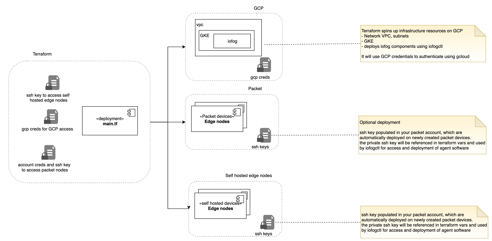

# Deployment
We use Terraform to deploy all infrastructure and ansible to configure remote edge nodes to install agent software.

## Components

The project spins up an infrastructure stack on Google Cloud Platform which consists of:
- vpc 
- subnets & firewall
- gke

Optionally, there is a choice to deploy x86 or arm nodes on Packet.

After the infrastructure setup, iofog ECN is deployed on the GKE cluster using the iofogctl.

Once the control plane is setup, ansible is used to configure edge nodes created by packet. Iofog agent software id deployed on these, configured and registerd with the iofog controller in the control plane. 

